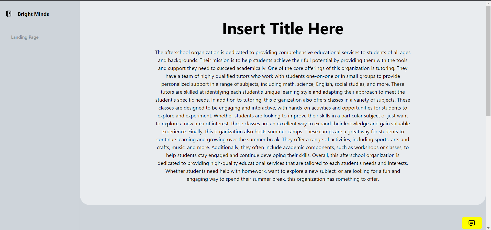
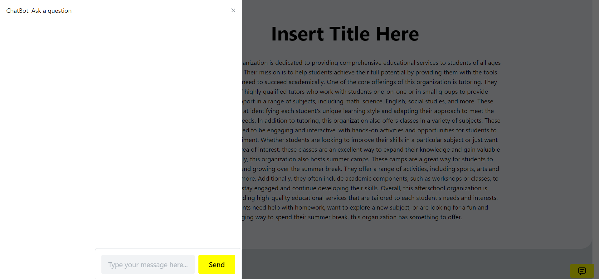
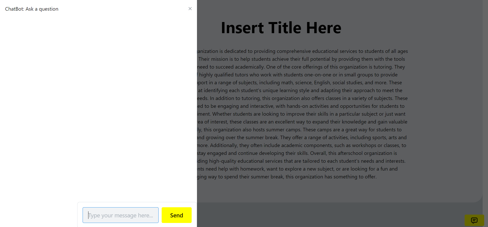
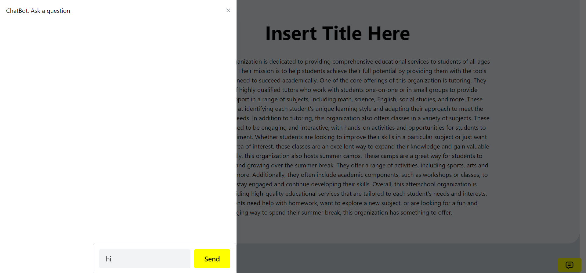
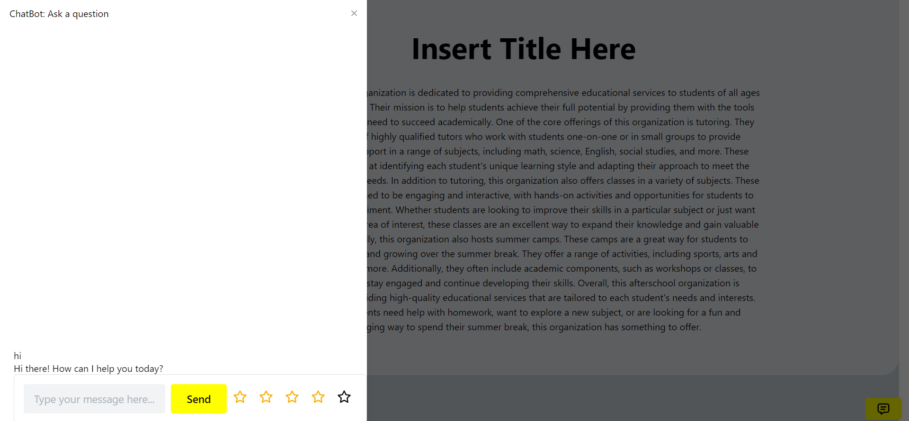
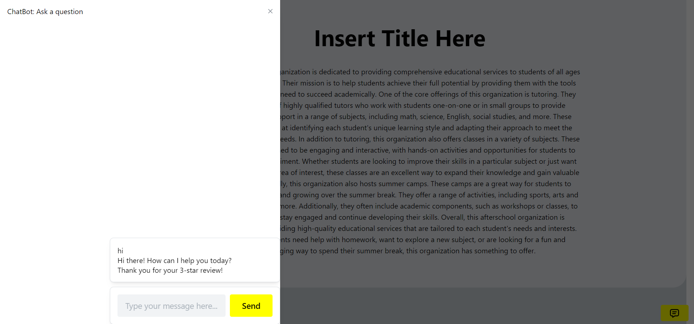

# Chatbot System

This is a simple chatbot system implemented in React using the Mantine UI library. The chatbot can respond to certain keywords and provide basic information, as well as receive star ratings from users.

## Installation

To run the chatbot system, you'll need to have npm installed on your system. Once you've cloned the repository, navigate to the project directory in your terminal and run the following command to install dependencies: npm install

## Usage

To start the development server, run the following command: npm start
This will start the chatbot system on your local machine

Once in the website follow these steps:

1-Click on the icon that shows a message at the bottom right of the screen

2-Click on the text box which shows up after the drawer opens

3-Type in your question to the chatbot

4-Click on either send or enter to ask it your question

5-After getting a reply star icons will show up click on the one that represents the accuracy of the answer

## Dependencies
- `React`
- `Mantine`
- `Tabler Icons`
- `@mantine/hooks`

## Components

The chatbot system is composed of the following components:

- `Chatbot`: The main chatbot component that handles user input, keyword recognition, and responses.
- `Drawer`: A Mantine UI component used to display the chatbot interface.
- `TextInput`: A Mantine UI component used to receive user input.
- `Button`: A Mantine UI component used to send user input and open the chatbot interface.
- `Card`: A Mantine UI component used to display chatbot responses.
- `Flex`: A Mantine UI component used to position chatbot components.
- `Group`: A Mantine UI component used to group chatbot components.
- `Box`: A Mantine UI component used to wrap chatbot responses.
- `ScrollArea`: A Mantine UI component used to enable scrolling on chatbot responses.

## Images

## Credits
This chatbot system was created by Mourad Rahi using React and the Mantine UI library.
