# Bright champs

## Admin

### 1- Log in

This is a simple log in page where the admin will be able to log in to the admin side of the website

#### Usage

All that is needed to do is to access the website and then the admin will be at the log in page where he can do a series of things:

- Enter an email
- Enter a password
- Click on the log in button
- Click on the Change password button

if he clicked on the change password button then a pop up will appear and they will be asked to do the following:

- Enter email
- Enter old password
- enter new password
- Save

#### Dependencies

- `React`
- `Mantine`
- `Tabler Icons`
- `@mantine/hooks`

#### Components

The Log in page system is composed of the following components:

- `Modal`: The Modal component is the pop up that contains the change password elements
- `Card`: A Mantine UI component used to display other Login information.
- `Flex`: A Mantine UI component used to position components.
- `Button`: A Mntine UI component used to link fuctionality to the website.

#### Images

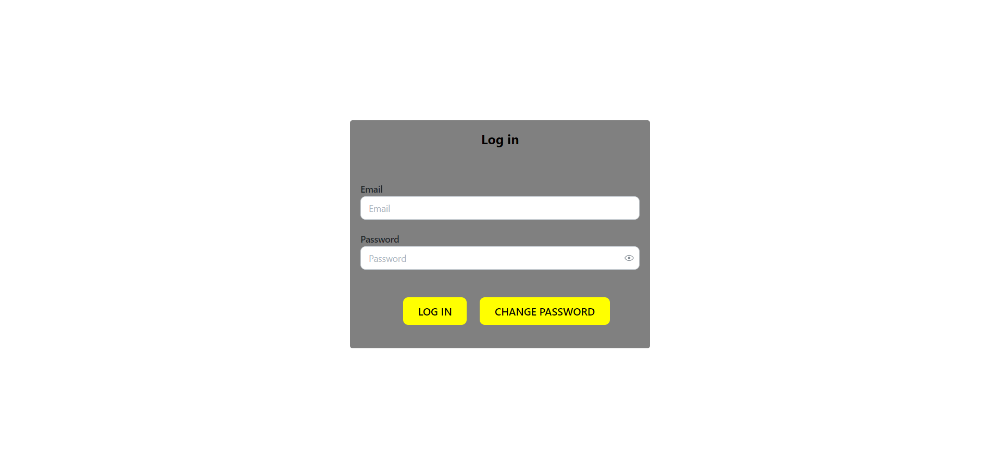

### 2- Home

This is a simple home page where the admin will be able to navigate through the website from it

#### Usage

All that is needed to do is to access the website through logging in and then the admin is at the home page and then do any of these:

- Click on the Classes button
- Click on the Camps button
- Click on the Tutoring button
- Click on the FAQ button
- Click on the About us button
- Click on any of the social media icons button

#### Dependencies

- `React`
- `Mantine`
- `Tabler Icons`
- `@mantine/hooks`

#### Components

The Home page system is composed of the following components:

- `Navbar`: The navbar component that groups items on the side of the screen.
- `Card`: A Mantine UI component used to display other pages on interest.
- `Flex`: A Mantine UI component used to position components.
- `Icon`: A Tabler UI component used to display social media icons that are linked to the company social media.

#### Images

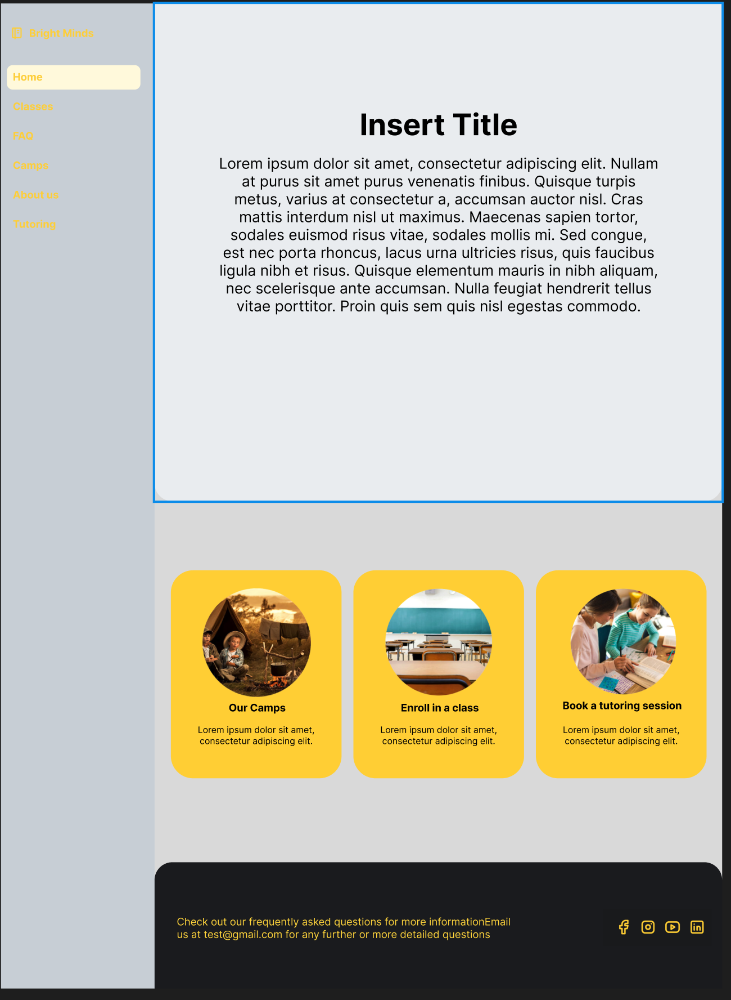

### 3- Camps

This is a simple camps page where the admin will be able to see and register in camps

#### Usage

All that is needed to do is to Ckick on the Camps card or on Camps in the navigation bar to access the page where you'll be able to do any of these:

- Click on the Camps button
- Click on the add camps button
- Click on the edit camps button
- Click on the delete button
- Click on any of the Navbar pages
- Click on any of the social media icons button

#### Dependencies

- `React`
- `Mantine`
- `Tabler Icons`
- `@mantine/hooks`

#### Components

The camps page system is composed of the following components:

- `Navbar`: The navbar component that groups items on the side of the screen.
- `Card`: A Mantine UI component used to display other pages on interest.
- `Flex`: A Mantine UI component used to position components.
- `Icon`: A Tabler UI component used to enable scrolling on chatbot responses.
- `Button`: A Mantine UI component used to include functionality

#### Images

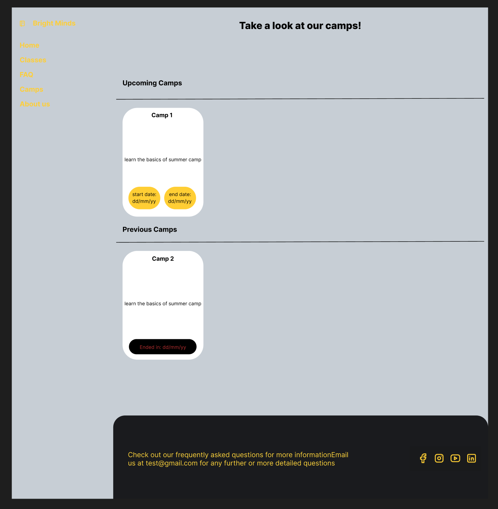

### 4- Classes

This is a simple home page where the user will be able to navigate through the website from it

#### Usage

All that is needed to do is to access the website and then the user is at the home page and then do any of these:

- Click on the Classes button
- Click on the Camps button
- Click on the Tutoring button
- Click on the FAQ button
- Click on the About us button
- Click on any of the social media icons button

#### Dependencies

- `React`
- `Mantine`
- `Tabler Icons`
- `@mantine/hooks`

#### Components

The chatbot system is composed of the following components:

- `Navbar`: The navbar component that groups items on the side of the screen.
- `Card`: A Mantine UI component used to display other pages on interest.
- `Flex`: A Mantine UI component used to position components.
- `Icon`: A Tabler UI component used to enable scrolling on chatbot responses.

#### Images

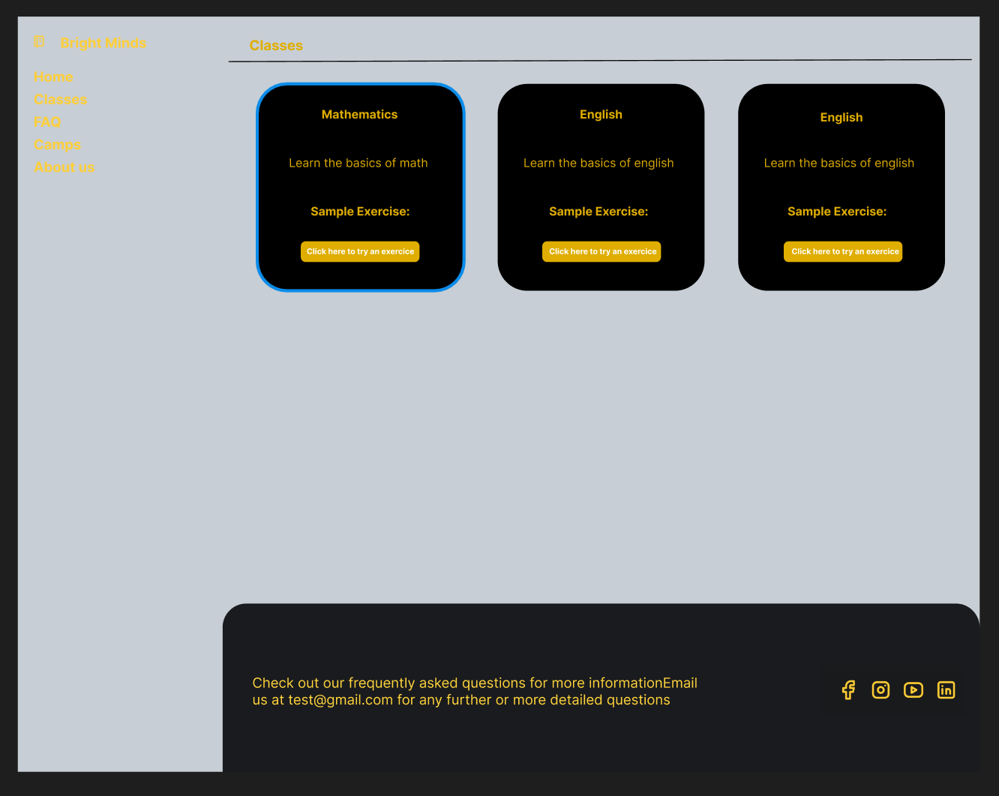

### 5- FAQ

This is a simple home page where the user will be able to navigate through the website from it

#### Usage

All that is needed to do is to access the website and then the user is at the home page and then do any of these:

- Click on the Classes button
- Click on the Camps button
- Click on the Tutoring button
- Click on the FAQ button
- Click on the About us button
- Click on any of the social media icons button

#### Dependencies

- `React`
- `Mantine`
- `Tabler Icons`
- `@mantine/hooks`

#### Components

The chatbot system is composed of the following components:

- `Navbar`: The navbar component that groups items on the side of the screen.
- `Card`: A Mantine UI component used to display other pages on interest.
- `Flex`: A Mantine UI component used to position components.
- `Icon`: A Tabler UI component used to enable scrolling on chatbot responses.

#### Images

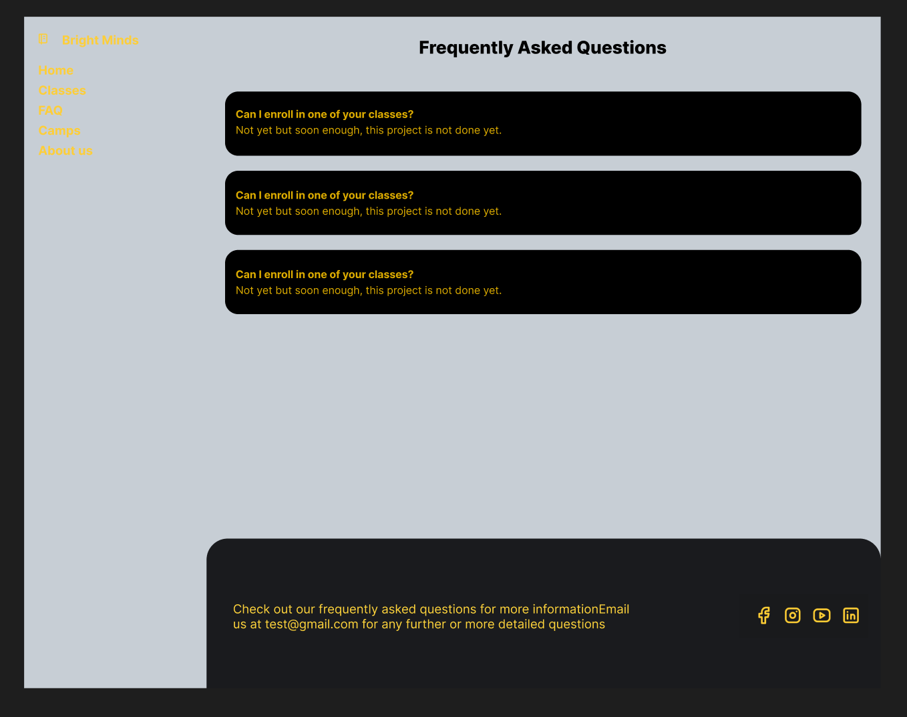

### 6- About us

This is a simple home page where the user will be able to navigate through the website from it

#### Usage

All that is needed to do is to access the website and then the user is at the home page and then do any of these:

- Click on the Classes button
- Click on the Camps button
- Click on the Tutoring button
- Click on the FAQ button
- Click on the About us button
- Click on any of the social media icons button

#### Dependencies

- `React`
- `Mantine`
- `Tabler Icons`
- `@mantine/hooks`

#### Components

The chatbot system is composed of the following components:

- `Navbar`: The navbar component that groups items on the side of the screen.
- `Card`: A Mantine UI component used to display other pages on interest.
- `Flex`: A Mantine UI component used to position components.
- `Icon`: A Tabler UI component used to enable scrolling on chatbot responses.

#### Images

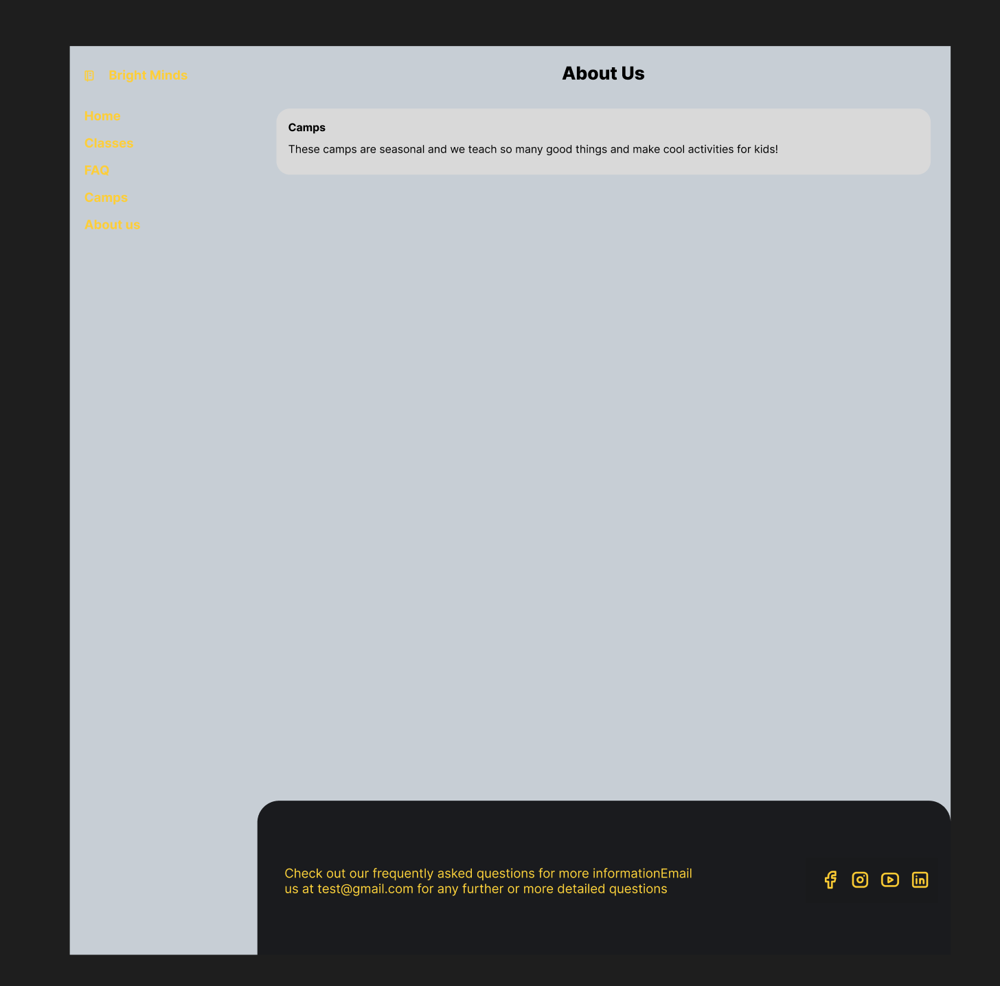

## User

### 2-Chatbot System

This is a simple chatbot system implemented in React using the Mantine UI library. The chatbot can respond to certain keywords and provide basic information, as well as receive star ratings from users.

#### Usage

Once in the website follow these steps:

1-Click on the icon that shows a message at the bottom right of the screen

2-Click on the text box which shows up after the drawer opens

3-Type in your question to the chatbot

4-Click on either send or enter to ask it your question

5-After getting a reply star icons will show up click on the one that represents the accuracy of the answer

#### Dependencies
- `React`
- `Mantine`
- `Tabler Icons`
- `@mantine/hooks`

#### Components

The chatbot system is composed of the following components:

- `Chatbot`: The main chatbot component that handles user input, keyword recognition, and responses.
- `Drawer`: A Mantine UI component used to display the chatbot interface.
- `TextInput`: A Mantine UI component used to receive user input.
- `Button`: A Mantine UI component used to send user input and open the chatbot interface.
- `Card`: A Mantine UI component used to display chatbot responses.
- `Flex`: A Mantine UI component used to position chatbot components.
- `Group`: A Mantine UI component used to group chatbot components.
- `Box`: A Mantine UI component used to wrap chatbot responses.
- `ScrollArea`: A Mantine UI component used to enable scrolling on chatbot responses.

#### Images
Step 1:
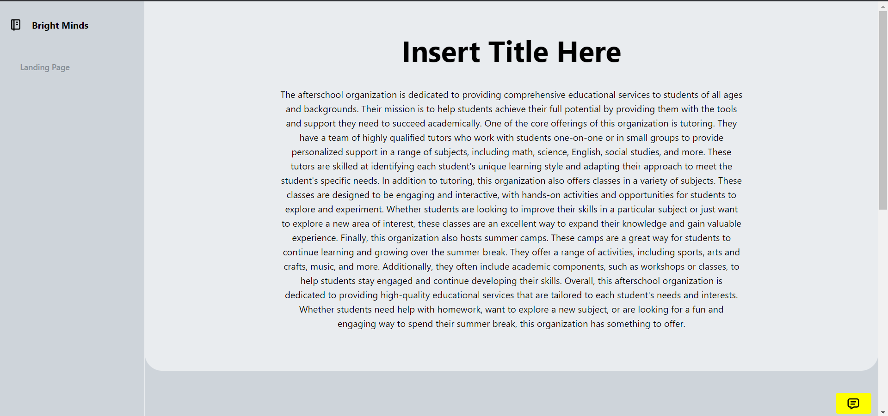

Step 2:
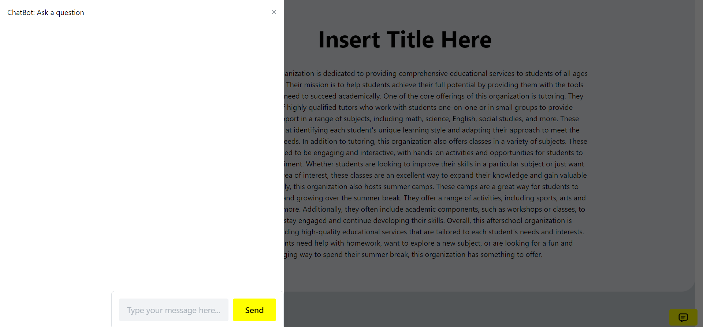

Step 3:
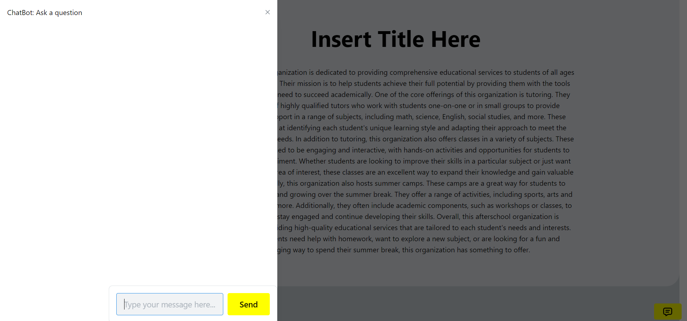

Step 4:
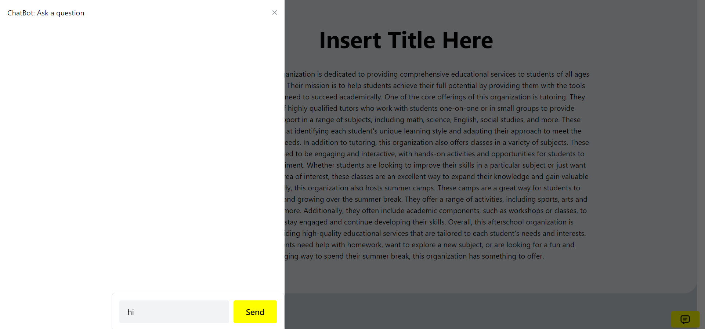

Step 5:
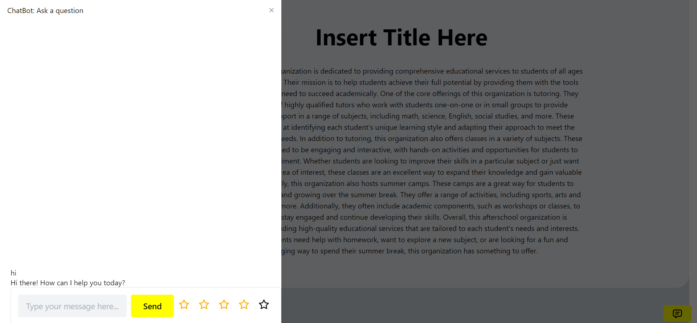

Step 6:
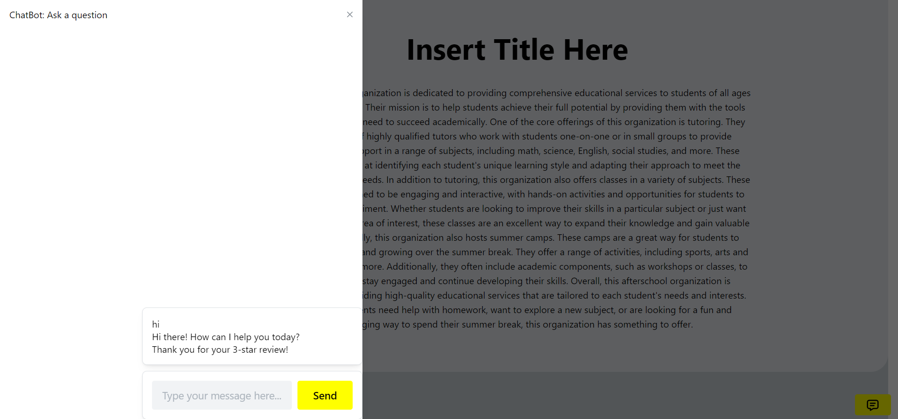

